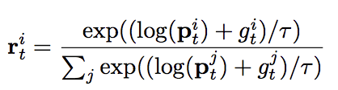

# Introduction  
This is a PyTorch implementation of [Neural Speed Reading via Skim-RNN](https://arxiv.org/pdf/1711.02085.pdf) published on ICLR 2018.


The imdb dataset is used by default and stored in the *./data* folder. 
Besides, the 300 dimensional GloVe word embedding trained under [840 billion words](http://nlp.stanford.edu/data/glove.840B.300d.zip)
is used.

Unlike [Skip RNN](https://arxiv.org/abs/1708.06834) or [Jump LSTM](https://arxiv.org/abs/1704.06877) where the objective is discrete,
Skim RNN introduces the Gumbel-softmax parametrization trick that makes the skimming objective differentiable:

{:height="36px" width="36px"}

# Usage
```
python main.py [arguments]
```

# Arguments
```
-h, help                    help
-large_cell_size            size of the large LSTM
-small_cell_size            size ofthe small LSTM
```